# Merchroom — System Design / Architecture / Design Patterns

## 1. System Design (การออกแบบระบบโดยรวม)

### 1.1 ภาพรวมระบบ (System Context)

ผู้ใช้เข้าถึงเว็บไซต์ผ่านเบราว์เซอร์ แอปเป็น SPA (Single Page Application) ที่โหลดครั้งเดียวแล้วเปลี่ยนหน้าด้วย React Router โดยตอนนี้ข้อมูลสินค้ามาจากไฟล์ mock ในเครื่อง แต่ฝั่ง backend เตรียม MongoDB ไว้แล้ว

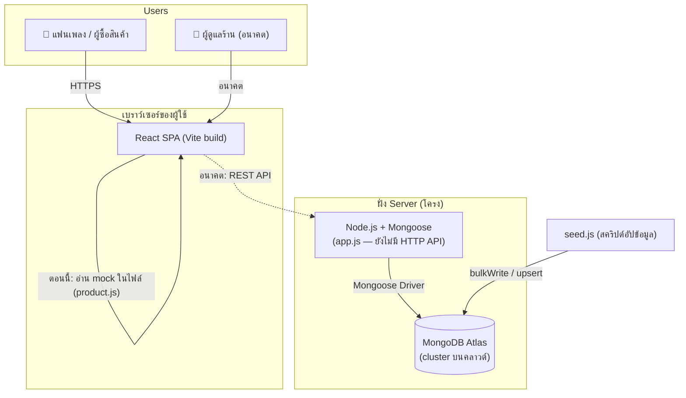

### 1.2 Container Diagram — แต่ละส่วนรับผิดชอบอะไร

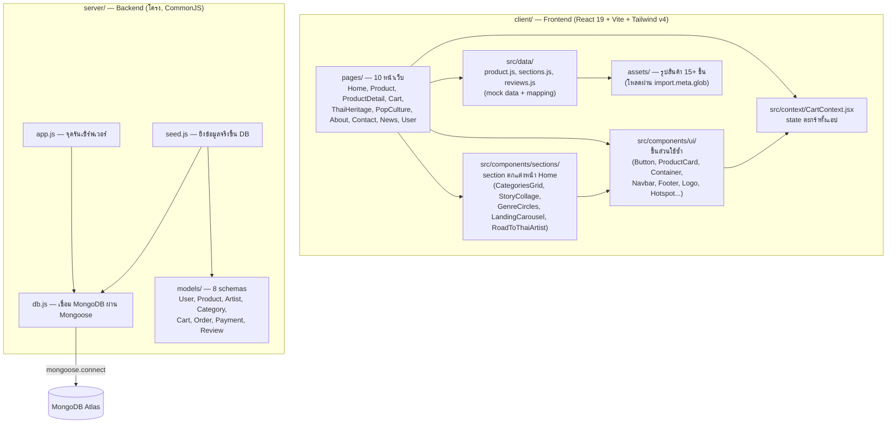

### 1.3 Data Flow ปัจจุบัน — เพิ่มสินค้าลงตะกร้า (ระบบที่ทำงานจริงตอนนี้)

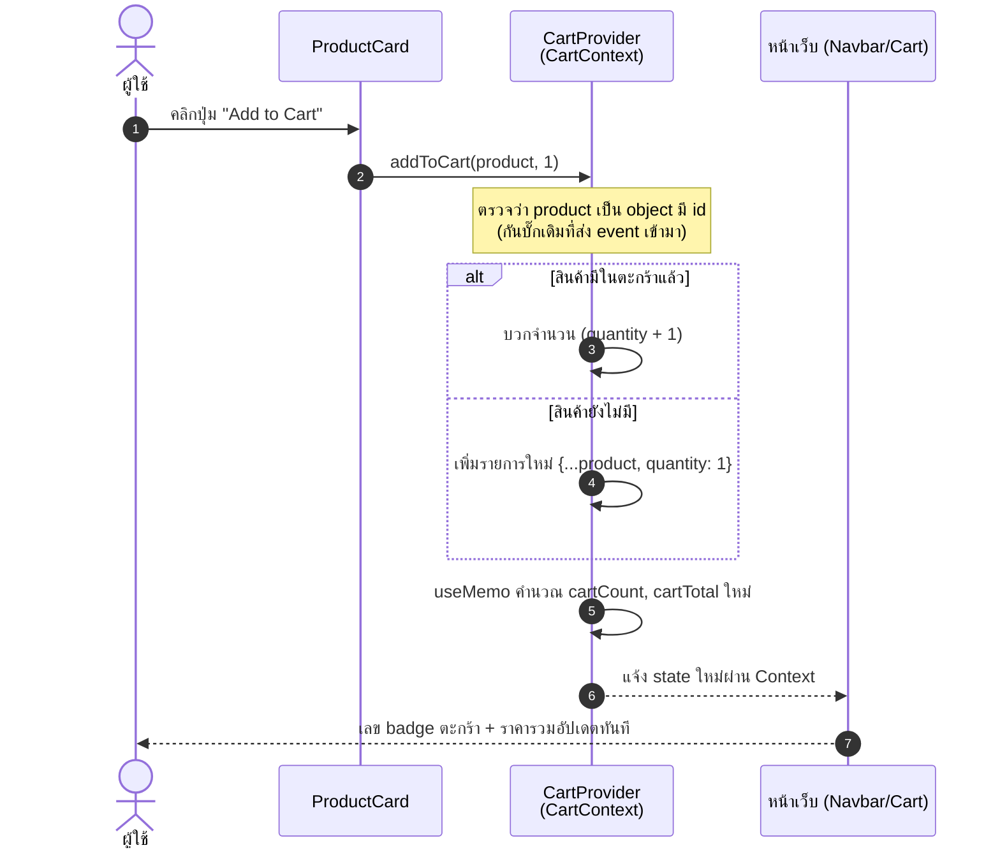

### 1.4 Data Flow อนาคต — เมื่อเชื่อม API แล้ว (ตามแผนใน AGENTS.md)

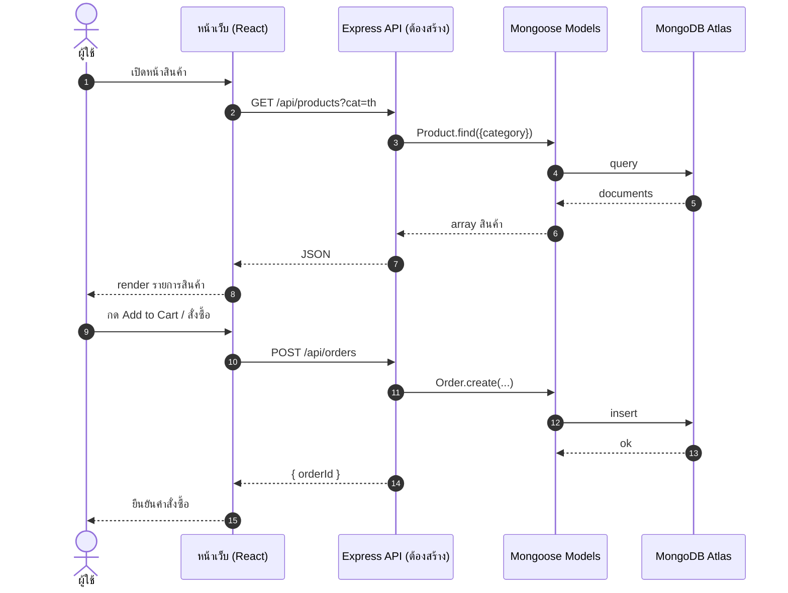

### 1.5 โมเดลข้อมูลฝั่งฐานข้อมูล (จาก server/models/)

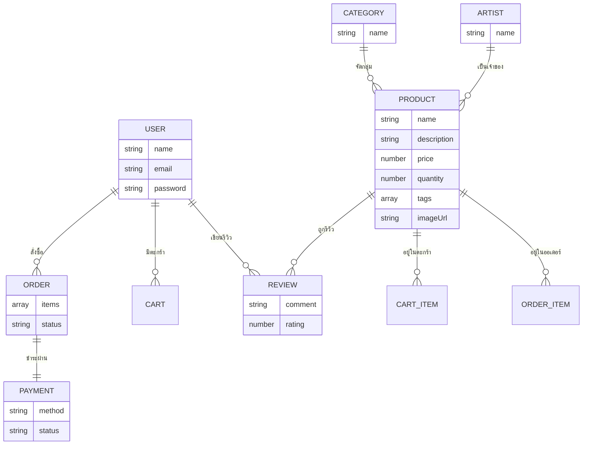

> หมายเหตุ: `Product` ใน schema อ้าง `Category` แบบ required และ `Artist` แบบ optional
> (ดู `server/models/Product.js`) — ฝั่ง mock ใน `client/src/data/product.js` ใช้ id แบบ `01th`, `02en` แทน

---

## 2. Software Architecture

### 2.1 สไตล์สถาปัตยกรรมที่ใช้

| แง่มุม | สิ่งที่ใช้ | เหตุผล |
|---|---|---|
| โครงระบบรวม | **Client–Server (จะเป็น 2-tier เมื่อ API พร้อม)** | frontend กับ backend แยกโฟลเดอร์ / แยก ESM-CommonJS ชัดเจน |
| Frontend | **Component-Based Architecture** (SPA) | ทุกหน้าประกอบจาก component ใช้ซ้ำ |
| State | **Shared State via Context** | ตะกร้าอยู่ที่ `CartContext` จุดเดียว |
| Data layer | **Mock Repository** (สลับเป็น API ภายหลัง) | `src/data/*.js` เป็นที่อยู่ข้อมูลเดียวตอนนี้ |
| Backend | **Model Layer อย่างเดียวก่อน** (ยังไม่มี Layer Route/Controller) | `models/` พร้อม 8 schema, `db.js` เป็นผู้เชื่อมต่อเดียวของระบบ |
| Styling | **Design Token ผ่าน Tailwind v4 `@theme`** | ห้าม hardcode สี — ทุกสีอ้าง token ใน `index.css` |

### 2.2 Layered View ฝั่ง Frontend

อ่านจากบนลงล่าง = ความเฉพาะเจาะจงมากขึ้น ห้ามข้ามชั้นย้อนกลับ (เช่น component ui ห้าม import หน้า)

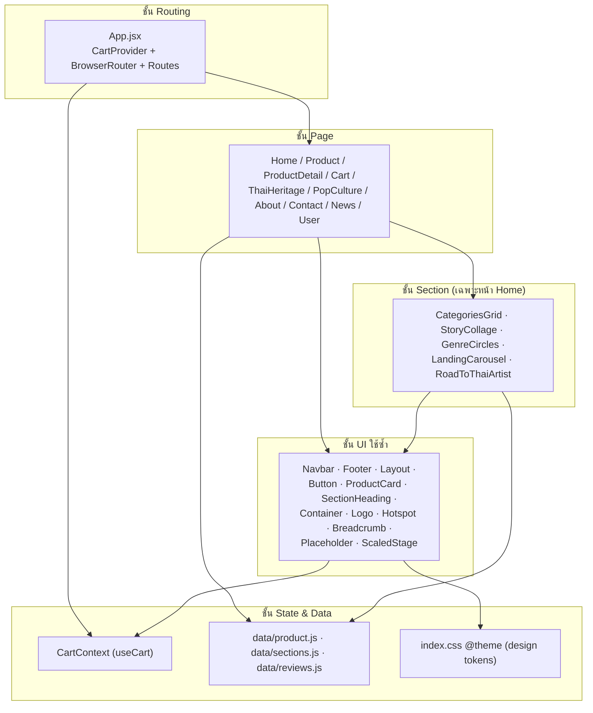

### 2.3 Component Tree ของแอป (จาก App.jsx จริง)

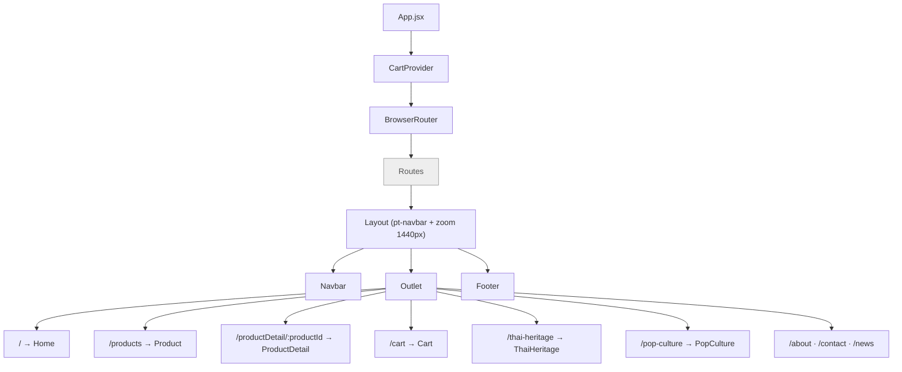

### 2.4 โครงสร้าง monorepo (2 แพ็กเกจแยกมาตรฐาน module)

```
Merchroom.zcode/
├─ client/                 ESM (import) — React 19 + Vite + Tailwind v4
│  ├─ index.html           ← ไฟล์จริงที่ใช้ (อีกไฟล์ที่รากเป็นของเก่า)
│  ├─ pages/               ← หน้าเว็บ อยู่นอก src/ โดยเจตนา (เลี่ยง merge conflict)
│  ├─ assets/              ← รูป: Thai / Eng / Heritage / Banner / Merchroom-Logo
│  └─ src/
│     ├─ App.jsx           ← route ทั้งหมด
│     ├─ index.css         ← @theme: design tokens ทั้งหมด
│     ├─ components/{ui,sections}/
│     ├─ context/CartContext.jsx
│     └─ data/             ← mock: product.js, sections.js, reviews.js
├─ server/                 CommonJS (require) — Node + Mongoose
│  ├─ app.js               ← จุดรัน (ตอนนี้แค่ connectDB)
│  ├─ db.js                ← mongoose.connect + dns fallback
│  ├─ seed.js              ← upsert ข้อมูลจริงเข้า Atlas
│  └─ models/              ← 8 schemas
└─ Docs/                   ← BMC, ER diagram, use case
```

ข้อสังเกตสำคัญ: **`pages/` อยู่นอก `src/`** — ทำให้ import จากหน้าต้องเขียน `'../src/...'` ตามตัวอย่างใน App.jsx

---

## 3. Design Patterns ที่ใช้จริงในโค้ด

### 3.1 ตารางสรุป

| # | Pattern | ประเภท | จุดที่ใช้ในโปรเจกต์ | ผลที่ได้ |
|---|---|---|---|---|
| 1 | **Provider / Global State (Context + Reducer-ish updater)** | Behavioral | `CartContext.jsx` | state ตะกร้าใช้ร่วมกันทุกหน้าโดยไม่ต้อง prop drilling |
| 2 | **Custom Hook (Facade ของ Context)** | Creational/封装 | `useCart()` | ซ่อนรายละเอียด Context + บังคับใช้ภายใต้ Provider เท่านั้น (throw error ถ้าใช้นอก) |
| 3 | **Memoization (Observer-like re-render)** | Behavioral | `useMemo` ใน CartProvider, `useCallback` ทุก action | คำนวณ `cartCount`/`cartTotal` ใหม่เมื่อ items เปลี่ยนเท่านั้น |
| 4 | **Composition over Inheritance (Slot / Children)** | Structural | `Layout` + `Outlet`, `CartProvider({children})` | โครงหน้า (Navbar/Footer) ครอบหน้าลูกโดยไม่รู้จักหน้าลูก |
| 5 | **Facade** | Structural | `ui/Button` (variant/size/`to`), `ui/Logo` (tone/size) | ซ่อนรายละเอียด (Link, viewBox crop, token สี) ไว้หลัง API ง่าย ๆ |
| 6 | **Template View (Layout Route)** | Structural | `App.jsx` ครอบทุก route ด้วย `<Layout>` | หน้าใหม่ไม่ต้องใส่ Navbar/Footer เอง |
| 7 | **Mock Data Layer / Repository (กำลังจะเป็น Proxy ของ API)** | Structural | `src/data/product.js` | เปลี่ยนจาก mock เป็น API ได้โดยแก้จุดเดียว |
| 8 | **Singleton (connection holder)** | Creational | `server/db.js` | มีท่อเชื่อม MongoDB จุดเดียว — ทุก model ใช้ท่อนี้ |
| 9 | **Schema / Model (Active Record-ish ของ Mongoose)** | Data | `server/models/*.js` | กำหนดรูปร่างข้อมูล + validation กลางที่เดียว |
| 10 | **Upsert / Idempotent Seeding** | Data pattern | `server/seed.js` (`bulkWrite` + `upsert: true`) | รันซ้ำได้ ไม่ซ้ำข้อมูล ไม่ลบของเดิม |
| 11 | **Config via Environment** | Creational-ish | `dotenv` + `MONGO_URI` | ไม่ hardcode connection string ในโค้ด |

### 3.2 Pattern #1–#3: CartContext (Provider + Custom Hook + Memoization)

```mermaid
classDiagram
    class CartProvider {
        -items : Product[]  (useState)
        +addToCart(product, qty)
        +removeFromCart(id)
        +updateQuantity(id, qty)
        +cartCount : number  (useMemo)
        +cartTotal : number  (useMemo)
    }
    class CartContext {
        <<React Context>>
        value = {items, cartCount, cartTotal, ...actions}
    }
    class useCart {
        <<custom hook>>
        +useCart() CartValue
    }
    class Pages {
        Home / Product / ProductDetail / Cart / Navbar
    }

    CartProvider ..|> CartContext : สร้าง + ให้ value
    useCart ..> CartContext : useContext()
    Pages --> useCart : เรียกใช้
    note for useCart "throw error ถ้าเรียกนอก Provider\n= บังคับให้ใช้ถูกตำแหน่ง"
```

**เหตุผลเชิงออกแบบ** — ใน `CartContext.jsx`:
- ทุก action ถูก `useCallback` ครอบ → reference คงที่ ทำให้ `useMemo` ของ `value` ไม่สร้าง object ใหม่โดยไม่จำเป็น → หน้าที่ consume ไม่ re-render ฟรี ๆ
- `cartCount` / `cartTotal` เป็น **derived state** (คำนวณจาก items ด้วย `useMemo`) ไม่เก็บ state ซ้ำ — กัน state ไม่ sync
- `addToCart` ทำ **immutable update** (`map`/`filter`/spread) ตามหลัก React state

### 3.3 Pattern #4 + #6: Layout ด้วย Composition (Outlet = ช่องสำหรับหน้าลูก)

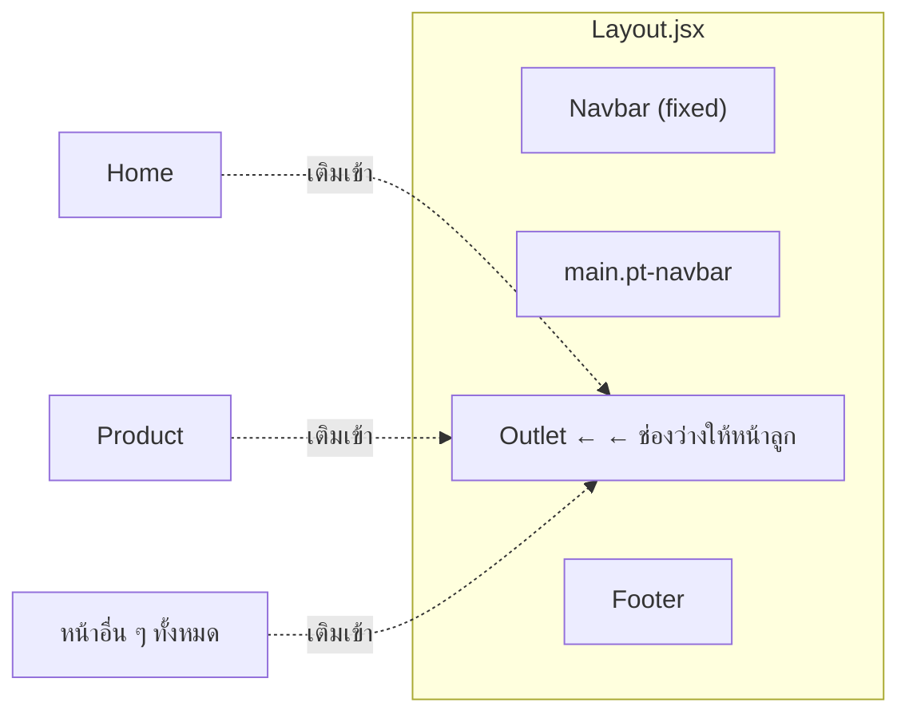

`App.jsx` ประกาศ route ลูกทั้งหมดภายใต้ `path:"/"` → ทุกหน้าได้ Navbar/Footer ฟรี (เทียบเท่า **Template Method** ในโลก component) และ `Layout` ยังทำ zoom scaling ตามความกว้างจอ (ฐาน 1440px) ให้ทุกหน้าโดยไม่ให้หน้าลูกต้องรู้

### 3.4 Pattern #5: Facade — ui/Button และ ui/Logo

```mermaid
classDiagram
    class Button {
        +variant : 'primary'|'highlight'|'outline'|'ghost'
        +size : 'lg(52px)'|'md(44px)'|'sm(36px)'
        +to : string?
        render()
    }
    class Logo {
        +tone : 'light'|'lime'
        +size : 'md'|'lg'
        render()
    }
    note for Button "ถ้ามี prop to → เปลี่ยนเป็น <Link>\nผู้ใช้ไม่ต้องครอบ <Link> เอง\nสีทั้งหมดอ้าง design token ห้าม hex"
    note for Logo "ซ่อนเรื่อง SVG 1500x1500 ที่ต้อง crop viewBox\n(wordmark-white/lime, icon-mushroom)\nไว้หลัง API ง่าย ๆ ตัวเดียว"
    class ผู้เรียก
    ผู้เรียก --> Button : แค่เลือก variant/size
    ผู้เรียก --> Logo : แค่เลือก tone/size
```

นี่คือเหตุผลที่ AGENTS.md กติกาข้อ 3 ให้ใช้ component ที่มีก่อน — เดิม ProductCard ถูก copy-paste 2 ที่แล้วหน้าตาไม่ตรงกัน

### 3.5 Pattern #7: Mock Data Layer (แนว Repository)

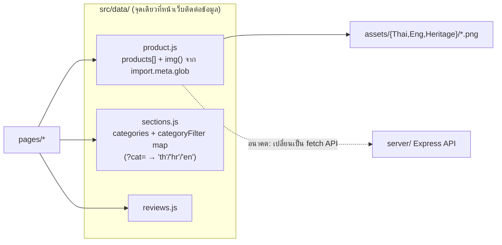

ประโยชน์: `Product.jsx` filter ด้วย `?cat=` ผ่าน mapping ใน `sections.js` — ถ้าเพิ่ม category แก้ที่ไฟล์เดียว และเวลาเปลี่ยนเป็น API จริง แก้ที่ data layer เท่านั้น หน้าอื่นไม่กระทบ

### 3.6 Pattern #8 + #9 + #11: ฝั่ง Server — Singleton connection + Schema/Model + dotenv

```mermaid
graph TD
    APPS["app.js (จุดรัน)"] -->|"require"| DBMOD["db.js<br/>connectDB()"]
    DBMOD -->|dotenv.config()| ENV[(".env: MONGO_URI")]
    DBMOD -->|mongoose.connect(uri) ครั้งเดียว| CONN["ท่อเชื่อมต่อเดียวของระบบ"]
    MODELSJS["models/*.js (8 ไฟล์)"] -->|ใช้ท่อที่พร้อมแล้ว| CONN
    SEEDF["seed.js"] --> DBMOD
    SEEDF --> MODELSJS
    CONN -->|Mongoose Driver + DNS 8.8.8.8| ATLAS[("MongoDB Atlas")]
```

- **db.js เป็นจุดเชื่อมต่อเดียว (Singleton)** — comment ใน app.js ระบุชัด: model ทุกตัวใช้ท่อนี้ทันที
- ทุก model เป็น **Mongoose Schema** — กำหนด type/required/default/timestamps และ reference (`Product.category → Category`, `Product.artist → Artist`)
- `process.exit(1)` เมื่อต่อไม่ได้ = **fail fast** ให้รู้ตัวเร็วตอน deploy

### 3.7 Pattern #10: Idempotent Seeding (upsert)

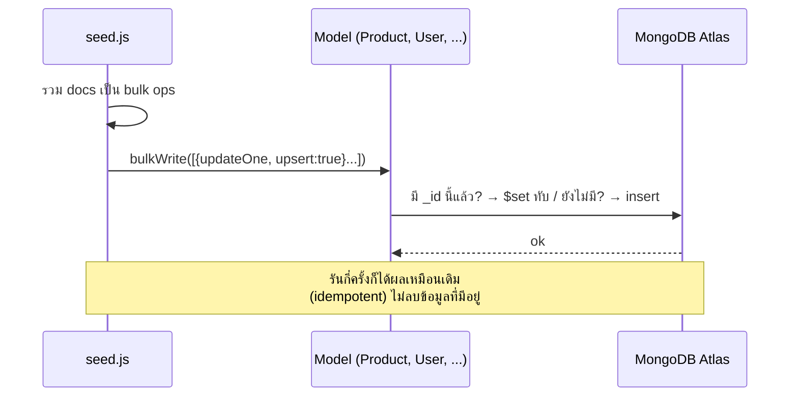

---

## 4. สรุปภาพเดียวจบ

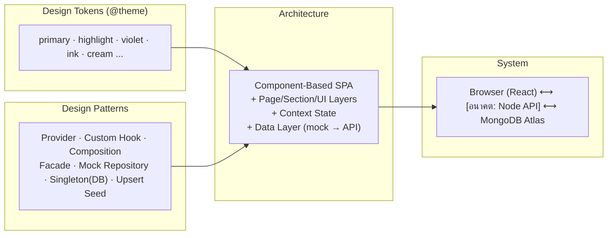

### ข้อเสนอแนะถัดไปเชิงสถาปัตยกรรม (เมื่อเริ่มทำ API)

1. **ฝั่ง server เพิ่มชั้น Route → Controller → Service → Model** แยกความรับผิดชอบ (ตอนนี้มีแค่ Model)
2. ฝั่ง client เพิ่ม **api client module** (`src/api/product.js`) เป็นชั้นกลางแทน import mock ตรง ๆ เพื่อให้สลับ mock/API ได้โดยไม่แตะหน้า
3. พิจารณา **custom hook สำหรับ fetch** (`useProducts(cat)`) ให้ทุกหน้าใช้รูปแบบเดียวกัน
4. เก็บ token การยืนยันตัวตนไว้ใน httpOnly cookie ฝั่ง server (ไม่เก็บใน localStorage)